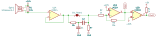
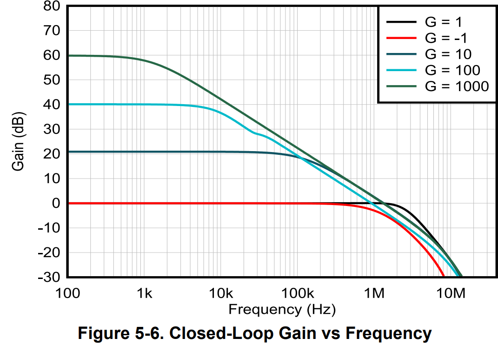
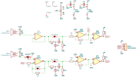

# Ultrasonic Anemometer

This project contains the circuit and code for a ultrasonic Anemometer. The anemometer works by 4 ultrasonic Transducers where 2 of them always face each other. 2 Transducers describe one Axis, so with 4 Transducers you can measure x and y Wind components. The circuit only recieves the signal and boosts a Peak-to-Peak Sine Voltage of 50mV to a Square Wave of VCC to 0V. With the microcontroller you have to compare the time difference between the output signal, a signal of 50% Duty Cycle 40kHz and the recieved signal. Then you can calibrate your sensor with 0 wind speed. In my case i measure the Clock Cycles of an ESP8266 to get a pretty precise time.

### Circuit Description

The circuit contains of a LM324 OP-Amp and an LM393 Comperator. With these 2 IC's you can archive processing for 2 Channels. after the signal is coming from the transducer it gets biased with a VCC/2 Voltage to be in a useful working range for the later components. Then the signal is fed through a voltage follower to get a low impedance signal for the next Amplifier stage. The next stage is, as said an inverting Amplifier with a gain of 10. The gain can't be to high to have a functioning amplification. As you can see if you have signal at 40kHz the maximum gain can be 10. 

After that the signal is fed into the LM393 Comparator. Keep in mind that to get the comperator to function you have to pull the output up. In the first revision of the board  (Rev 1) there are 2 Footprints of resistors too much (R5, R14).

### Modularity

In the standard configuration of the PCB 2 Channels are set up but if you have a weaker Signal you can cut the S2_EN between 1/2 and solder 2/3. By populating R17 and R18 you can transform your 1 Stage Amplifier in a 3 Stage Amplifier.

If you need an additional Filter you can cut EN_Filter and populate the Bandpass-Filter on the backside of the PCB.

### Full Circuit

The whole circuit contains 2 Channels with the logic to implement the 3 Stage Amplifier included in the lower one. Also there is power supply and connectors to the MCU.
